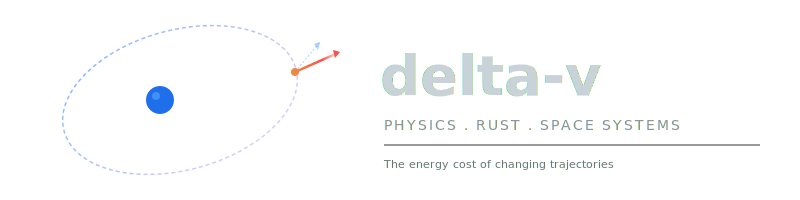

<div align="center">



### The energy cost of changing trajectories.

A self-paced, dependency-driven curriculum for becoming a **computational space systems engineer**.

Physics &nbsp;·&nbsp; Rust &nbsp;·&nbsp; Space Systems &nbsp;·&nbsp; AI &nbsp;·&nbsp; Quantum

Every equation becomes an executable. Every implementation gets tested, broken deliberately, and verified independently.

No borrowed understanding.

[License: MIT](LICENSE) &nbsp;·&nbsp; [Setup Guide](docs/setup.md) &nbsp;·&nbsp; [Method](docs/method.md) &nbsp;·&nbsp; [Full Curriculum](docs/curriculum.md)

</div>

---

## Table of Contents

- [What is this?](#what-is-this)
- [The Three Spines](#the-three-spines)
- [The 7-Step Learning Loop](#the-7-step-learning-loop)
- [Curriculum at a Glance](#curriculum-at-a-glance)
- [Repository Structure](#repository-structure)
- [Quick Start](#quick-start)
- [Session Map (First 30)](#session-map-first-30)
- [How to Follow Along](#how-to-follow-along)
- [The AI Rule](#the-ai-rule)
- [License](#license)

---

## What is this?

This repo is the code implementation of the [Frontier Engineer Field Manual](https://github.com/Farzin312/delta-v) -- a 104-unit path from high-school algebra to building mission-grade space systems software. It is a **build log**: every concept is implemented in Rust, tested against known physics, deliberately broken, and verified independently.

The destination is a specific kind of engineer:

> **Computational space systems engineer** -- someone who can move from physical law to verified software, from data to trustworthy autonomy, and from a mission idea to reproducible evidence.

This is the overlap that most candidates leave empty:

```
  +-----------------------------------------------------------+
  |                                                           |
  |    "I can derive the physics, implement it in safe Rust,  |
  |     test it against independent references, and tell you  |
  |     exactly where and why it will fail."                  |
  |                                                           |
  |           Most people can do one of these.                |
  |           Very few can do all four.                       |
  |           That intersection is the point.                 |
  |                                                           |
  +-----------------------------------------------------------+
```

---

## The Three Spines

Everything is built along three spines simultaneously. No spine is optional.

```
  +---------------------+  +---------------------+  +---------------------+
  |  PHYSICAL REASONING |  |  SOFTWARE SYSTEMS   |  | EVIDENCE & JUDGMENT |
  +---------------------+  +---------------------+  +---------------------+
  | Mechanics           |  | Rust (from Day 1)   |  | Requirements        |
  | Dynamics            |  | Python (science)    |  | Uncertainty         |
  | Calculus            |  | C/C++ interop       |  | Validation          |
  | Linear algebra      |  | Testing / fuzzing   |  | Independent refs    |
  | Numerics            |  | OS / embedded       |  | Failure analysis    |
  | Controls            |  | Real-time           |  | Technical writing   |
  | Estimation          |  | Networking          |  | Peer review         |
  | Probability         |  | Security            |  |                     |
  +---------+-----------+  +---------+-----------+  +---------+-----------+
            |                        |                        |
            +------------------------+------------------------+
                                     |
                          +----------+----------+
                          | Computational Space |
                          | Systems Engineer    |
                          +---------------------+
```

Read more: [docs/method.md](docs/method.md)

---

## The 7-Step Learning Loop

Every session follows this loop. It is the engine of the entire curriculum.

```
  PREDICT      Write sign, scale, direction BEFORE coding.
               (A prediction that can be wrong.)

  EXPLAIN      Draw the physical story. Name boundaries, frames, units.
               (A diagram + 5-sentence explanation.)

  DERIVE       From definitions to equation. Check dimensions.
               (Hand derivation, every symbol defined.)

  IMPLEMENT    Smallest clean Rust function expressing the idea.
               (Compiling code, clear API, no hidden I/O.)

  TEST         Known case + boundary + property + independent reference.
               (Automated tests + validation note.)

  FALSIFY      Change scale, sign, step, noise to make it BREAK.
               (A failure you can explain + declared domain.)

  TEACH        Explain what changed in your mental model.
               (README note, diagram, or recording.)
```

Every practice file in this repo has a `BRIEF.md` that walks you through all seven steps. See [docs/method.md](docs/method.md) for the full methodology, including where programming design and architecture fit into the loop.

---

## Curriculum at a Glance

104 units across 13 stages. Unit numbers show dependency order, not weeks.

```
  Stage  1  ===========  Rust + Mathematical Language          (Units  1- 8)
  Stage  2  ===========  Calculus + Numerical Mechanics         (Units  9-16)
  Stage  3  ===========  Orbital Mechanics Core                 (Units 17-24)
  Stage  4  ===========  Mission Analysis                       (Units 25-32)
  Stage  5  ===========  Attitude + Control                     (Units 33-40)
  Stage  6  ===========  Estimation + Signals                   (Units 41-48)
  Stage  7  ===========  Systems + Embedded                     (Units 49-56)
  Stage  8  ===========  Flight Software Architecture           (Units 57-64)
  Stage  9  ===========  Verification + Security                (Units 65-72)
  Stage 10  ===========  Scientific AI                          (Units 73-80)
  Stage 11  ===========  Robotics + Autonomy                    (Units 81-88)
  Stage 12  ===========  Multiphysics Space Systems             (Units 89-96)
  Stage 13  ===========  Specialization + Public Evidence       (Units 97-104)
```

Each stage ends with a **capstone** you must defend without AI-generated explanations.

Read the full map: [docs/curriculum.md](docs/curriculum.md)

---

## Repository Structure

This repo follows a scalable pattern. Each stage gets a directory. Each unit/session within it gets a subdirectory. Every subdirectory is a self-contained Cargo project with the same three files.

```
delta-v/
|
|-- assets/
|   |-- logo.svg                <-- Full logo with tagline
|   |-- icon.svg                <-- Square icon (for social/Og)
|
|-- docs/                       <-- Deep guides for following along
|   |-- curriculum.md           <-- Full 104-unit, 13-stage map
|   |-- method.md               <-- The 7-step loop, programming approach,
|   |                               AI-quarantine, mastery gates, field checklists
|   |-- setup.md                <-- Environment setup, how to run, engineering log
|
|-- first_30/                   <-- Stages 1-2 launch sessions
|   |-- CATALOG.md              <-- Master index with difficulty + status tracking
|   |-- practice_01/            <-- Session 01: Make an equation executable
|   |   |-- BRIEF.md            <-- Problem, 7-step loop, hints, checklist, notes
|   |   |-- Cargo.toml          <-- Independent Cargo project
|   |   |-- src/
|   |       |-- main.rs         <-- Scaffold: prediction/derivation/code/tests
|   |-- practice_02/            <-- Session 02
|   |-- ...                     <-- Sessions 03-29
|   |-- practice_30/            <-- Session 30: Ship a verified mechanics slice
|
|-- LICENSE                     <-- MIT (see below)
|-- README.md                   <-- You are here
```

**Key design decision:** Each `practice_NN/` is a standalone Cargo project. No shared workspace, no shared dependencies. Every session is self-contained and can be understood in isolation. This pattern extends to future stages.

---

## Quick Start

```bash
# Clone
git clone https://github.com/Farzin312/delta-v.git
cd delta-v

# Pick a session
cd first_30/practice_01

# Read the brief
cat BRIEF.md

# Start implementing
cargo run
cargo test
```

Full setup instructions: [docs/setup.md](docs/setup.md)

---

## Session Map (First 30)

The first 30 sessions build the permanent loop. Later units apply it to harder material.

| # | Title | Concept | Difficulty |
|:-:|---------|---------|:----------:|
| 01 | Make an equation executable | cargo, f64, functions, println! | \| |
| 02 | Turn algebra into a tested function | functions, #[test] | \| |
| 03 | Represent failure honestly | Result, enums, ? operator | \| |
| 04 | Make units visible in types | tuple structs, newtype | \|\| |
| 05 | Own a small vector type | structs, methods, derive | \|\| |
| 06 | Radians before trigonometry | constants, constructors | \|\| |
| 07 | Sample a changing state | loops, Vec, iterators | \|\| |
| 08 | Model context with enums | enums, match | \|\| |
| 09 | Compute dot products from slices | slices, iterators, zip | \|\|\| |
| 10 | Build a maintainable crate | modules, lib.rs, rustdoc | \|\|\| |
| 11 | Treat a graph as behavior | closures, sampling | \|\|\| |
| 12 | Approximate a derivative | higher-order functions | \|\|\| |
| 13 | Connect position, velocity, acceleration | windows, Option | \|\|\| |
| 14 | Accumulate change | trapezoid integration | \|\|\| |
| 15 | Release a constant-acceleration simulator | CLI, CSV, integration tests | \|\|\|\| |
| 16 | Graduate to Vec3 | operator traits, cross product | \|\|\|\| |
| 17 | Use projection and work | dot product, energy | \|\|\|\| |
| 18 | Rotate coordinates | rotation matrices | \|\|\|\| |
| 19 | Compose transformations | matrix composition | \|\|\|\| |
| 20 | Be honest about floating point | epsilon, approximate compare | \|\|\|\| |
| 21 | Translate a free-body diagram | force, mass, acceleration | \|\|\|\|\| |
| 22 | Implement inverse-square gravity | vector normalization, singularities | \|\|\|\|\| |
| 23 | Use conservation as an oracle | energy, invariants | \|\|\|\|\| |
| 24 | Connect impulse and momentum | delta-v, sign conventions | \|\|\|\|\| |
| 25 | Write a state derivative | ODE state-space, traits | \|\|\|\|\| |
| 26 | Take the first numerical step | Euler integration | \|\|\|\|\| |
| 27 | Implement midpoint before RK4 | second-order integration | \|\|\|\|\| |
| 28 | Run a convergence study | error analysis, log-log | \|\|\|\|\| |
| 29 | Test properties, not only examples | property testing | \|\|\|\|\| |
| 30 | Ship a verified mechanics vertical slice | workspace, CI, release | \|\|\|\|\|\| |

Full session catalog with status tracking: [first_30/CATALOG.md](first_30/CATALOG.md)

---

## How to Follow Along

**If you are learning alongside this repo:**

1. Read [docs/setup.md](docs/setup.md) to get Rust running.
2. Start with Session 01. Open `first_30/practice_01/BRIEF.md`.
3. Follow all 7 steps. Do not skip to code. Predict first.
4. Before reading any hints, struggle. The struggle IS the learning.
5. Check the [mastery gate](docs/method.md#6-mastery-gate-advance-only-when-all-are-true) before moving on.
6. Fill in the Notes section of each BRIEF.md as you go.

**If you are browsing:**

- [docs/curriculum.md](docs/curriculum.md) -- see the full 104-unit path.
- [docs/method.md](docs/method.md) -- understand why the code is structured this way.
- Each BRIEF.md is self-contained and readable in isolation.

**No fixed calendar.** A unit may take two days or a month. Advance only when the mastery gate is met.

---

## The AI Rule

> Use AI to accelerate explanation, scaffolding, test generation, literature discovery, refactoring, and critique.
>
> Never let AI become the only entity that can explain a formula, invariant, unit, unsafe block, convergence result, dataset split, or mission decision.
>
> If AI writes code, you must re-derive and retype the essential path from memory later.

The full [AI-Quarantine Protocol](docs/method.md#7-the-ai-quarantine-protocol) defines seven sequential passes from cold start to ownership statement.

---

## Documentation

| Document | What is in it |
|----------|--------------|
| [docs/curriculum.md](docs/curriculum.md) | Full 104-unit map across 13 stages, portfolio evidence ladder, competitive positioning |
| [docs/method.md](docs/method.md) | The 7-step loop, programming approach, AI-quarantine protocol, understanding debt, field checklists, question ladder |
| [docs/setup.md](docs/setup.md) | Environment setup, tool installation, how to run, engineering log template |
| [first_30/CATALOG.md](first_30/CATALOG.md) | Session-by-session index with difficulty ratings and status tracking |

---

## License

This project is licensed under the [MIT License](LICENSE).

You are free to:
- **Clone and study** the curriculum structure and methodology
- **Follow along** and write your own implementations
- **Fork and adapt** the curriculum for your own learning path
- **Share** with others who want to build computational physics + systems engineering skills

The code you write in your practice sessions is yours. The curriculum structure, briefs, and methodology in this repo are open for anyone to use and adapt.

---

## Source

This repo implements the **Frontier Engineer Field Manual**.

<div align="center">

**Building in public. No borrowed understanding.**

</div>
